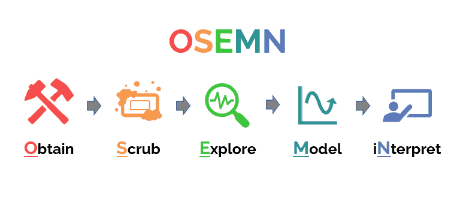
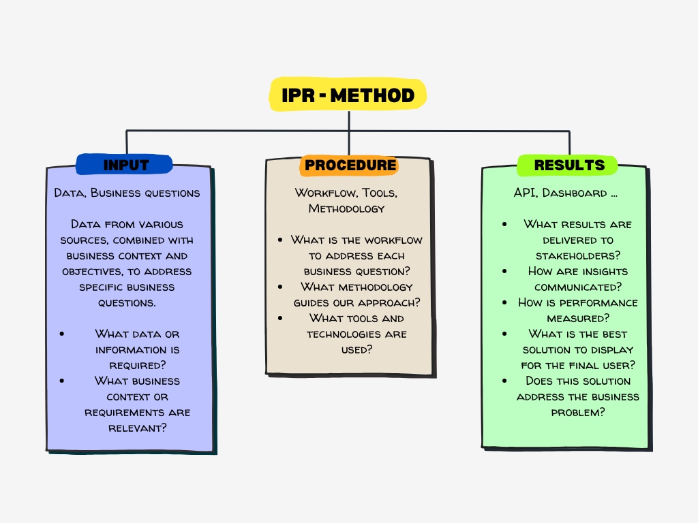
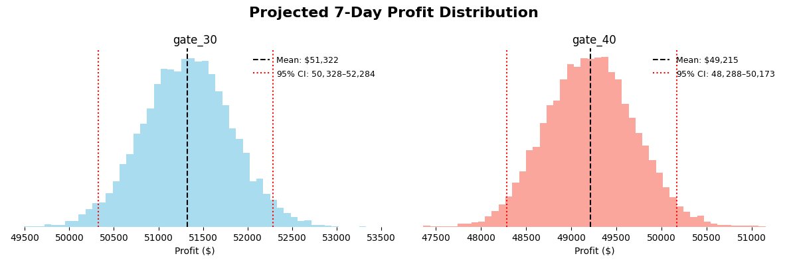
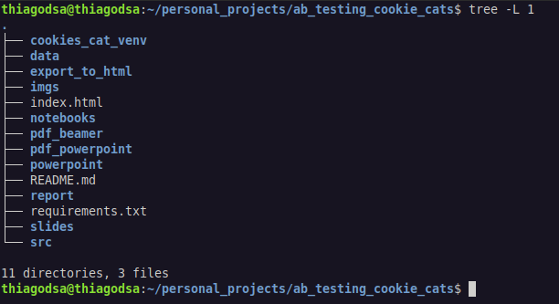

# Data Science Project

> Image from: [https://www.datascience-pm.com/osemn/](https://www.datascience-pm.com/osemn/)

# BAYESIAN A/B TESTING METHODOLOGY (OSEMN)

## Step 0: Obtain (Data + Business Understanding)

### Background

#### What is the company?

Tactile Entertainment

#### What does the company do?

Tactile Entertainment develops mobile games. Its flagship game, **Cookie Cats**, is a popular puzzle game where players connect tiles of the same color to clear levels. The game includes in-app purchases, time-based gates, and engagement features to enhance retention.

#### How does the company make money?

Revenue comes from **in-app purchases (IAPs)** and advertising. Players may encounter gates that limit progression unless they wait or pay, generating monetization opportunities.

##### Example:

- Original gate: Level 30
- Players must wait or pay to continue
- Revenue is generated if the player purchases skips
- Estimated revenue per retained player:
  - $2 from IAPs (players buy skips or boosters)
  - $1 from ads (ad impressions while waiting or playing)
  - Total: $3 per retained player

#### What challenge is the company facing?

The first gate has been moved from **level 30 to level 40**. Tactile Entertainment wants to understand:

- How delaying the first gate impacts **player retention**

The goal is to **analyze A/B test results using a Bayesian framework** and provide clear recommendations for game design.

## Step 1: Scrub (Data Understanding)

### Data Description

- Player-level anonymized data
- Control group: first gate at level 30
- Experiment group: first gate at level 40
- Metrics available in this dataset:
  - Retention (Day 1, Day 7)
  - Total game rounds played

### EDA and Data Quality Checks

- Missing values and outliers
- Distributions

## Step 2: Explore (Analysis Plan)

### Objective

Measure impact of moving the first gate on retention, engagement (Total Rounds), and business performance using a **Bayesian A/B testing approach**.

- Gate 30 = Control Group
- Gate 40 = Treatment Group
- Parameter of Interest: Retention probability (proporttion) and Total Rounds (mean) in each group:

$$
\theta_{control}, \theta_{treatment}
$$

- Prior: $\theta_i \sim \text{Beta}(1,1)$ (non-informative prior)
- Likelihood:

$$
Retention_i \sim \text{Binomial}(n_i, \theta_i), \quad i \in \{control, treatment\}
$$

- Posterior: Compute

$$
\text{Prob}(\theta_{control} | data) \text{ and } \text{Prob}(\theta_{treatment} | data)
$$

- Decision Rule:

$$
\text{Prob}(\theta_{treatment} > \theta_{control})
$$

- Credible Level: e.g., 0.95 for the posterior probability

## Step 3: Model (Procedure / IPR)

> Reference: [https://medium.com/@thiago.guimaraes.sto/thinking-about-data-science-structurally-the-quadruple-d-h-m-s-781eee1af2ff](https://medium.com/@thiago.guimaraes.sto/thinking-about-data-science-structurally-the-quadruple-d-h-m-s-781eee1af2ff)

**Input:**

- Business problem and hypotheses
- A/B test dataset (control vs experiment)
- Metrics of interest: retention
- Prior assumptions for Bayesian models (weakly informative or historical priors)

**Procedure:**

- Clean and prepare dataset
- Validate random assignment of players
- Fit Bayesian models for retention and engagement
  - Retention: Beta-Binomial model
  - Engagement/revenue: Normal or log-Normal model
- Compute posterior distributions and credible intervals
- Calculate probability of improvement for each metric
- Visualize posteriors, credible intervals, and probability of lift

**Result:**

- Posterior distributions for retention, engagement, and revenue
- Probability that moving the gate increases retention or revenue
- Credible intervals for metric differences
- Recommendations for gate placement based on Bayesian evidence

## Step 4: Interpret (Evaluation & Reporting)

- **Summarize results:**

  - Posterior estimates for retention, Total Rounds
  - Probability of improvement (lift) for each metric
  - 95% credible intervals for differences between control and treatment groups
- **Recommendations:**

  - Move the gate to level 40 if the Bayesian probability of lift exceeds the threshold of 95%
- **Business Performance:**
- Use the posterior lift distribution (with credible intervals) to estimate the potential revenue impact for the company, based on the monetization rules described in the Business Understanding section (e.g., revenue per retained player from IAPs and ads).
- **Deliverable:**

  - PDF containing presentations of the test: one from **PowerPoint** and another from **Beamer (LaTeX)**. See the report folder

  - HTML report of the entire **Jupyter notebook**. Execute the shell script in the export_to_hmtl folder to  generate it.

# Bayesian A/B Test Results

The analysis indicates a **low probability of improvement** for retention metrics (Day 1 and Day 7) and engagement (Total Rounds).
Therefore, there is **no strong statistical evidence** that the treatment version outperforms the control.

## **Recommendation:**

Keep **Gate 30 (Control)** as the active version and **continue monitoring performance** over the next cycles.

## Business Performance

We also projected the **expected business performance** based on the **posterior distribution of Day 7 retention**, as shown below:

## Additional Material

For a complete view of the project:

- See the folders **`pdf_powerpoint`** and **`pdf_beamer`**, which contain the presentation of the test generated from PowerPoint and Beamer (LaTeX).  

You can also view the PDFs online:  

- **PowerPoint version:** [View PDF](https://drive.google.com/file/d/1L3i55I5ra_Y7Qp6sGEkGHsOa5SfKdj5P/view?usp=sharing)  
- **Beamer (LaTeX) version:** [View PDF](https://drive.google.com/file/d/15mI3g8xP6lB2iI8nrmLMMzlAXmCI0ifU/view?usp=sharing)

The full pipeline that generates those PDF files is located in the **`report`** folder.

Furthermore, if you wish to view all the development and analysis, I **highly recommend** opening the URL generated by the shell script (see folder **`convert_to_html/`**).

[View the entire notebook on html](https://thiagogsdsa.github.io/ab_testing_game/)

# Project Placeholders

# Tools and Framework

The project was guided using the **OSEMN methodology**, with the sections and actions outlined above.

It was developed following a **Bayesian framework**. I created a class to perform Bayesian A/B tests, which is published on PyPI. By installing it with `pip`, it was possible to run the tests in this project.

You can check it out here: [ab_bayes_test GitHub](https://github.com/thiagogsdsa/ab_bayes_test)

Before applying the test, we performed an **EDA**. At the initial stage, we encountered approximately **11% outliers** in the variable `Total Rounds`. Instead of excluding them, we applied **Box-Cox** and **log+1 transformations**, reducing the outliers to almost zero.

We removed **4% of the data**, corresponding to users with zero engagement.
No missing values were found in the dataset.

# Lessons Learned

I learned how to build a **Bayesian A/B testing class from scratch** and apply it to a project with business impact.
The math and statistics behind Bayesian A/B testing are heavier than the frequentist approach, but it is more **straightforward**, requiring fewer steps and offering **intuitive probabilities** instead of hypothesis testing.

# Improvements

I tried to code as cleanly as possible to avoid bugs.
I am not entirely sure if the approach used in the report (see the script) is the optimal solution, so if you have any suggestions, please **reach out to me via the contacts below**. I would love to receive feedback!

# Contact

- **E-mail:** thiago.guimaraes.sto@gmail.com
- **LinkedIn:** thiagogsdsa
