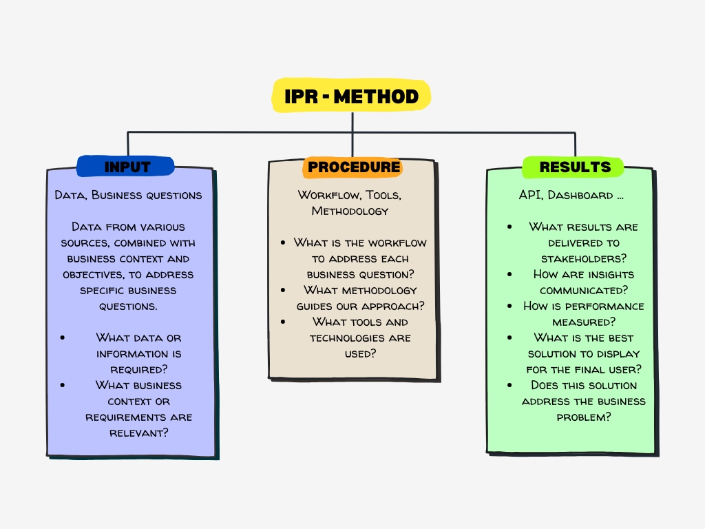

# Data Science Project

> Image from: [https://www.datascience-pm.com/osemn/](https://www.datascience-pm.com/osemn/)

# BAYESIAN A/B TESTING METHODOLOGY (OSEMN)

## Step 0: Obtain (Data + Business Understanding)

### Background

#### What is the company?

Tactile Entertainment

#### What does the company do?

Tactile Entertainment develops mobile games. Its flagship game, **Cookie Cats**, is a popular puzzle game where players connect tiles of the same color to clear levels. The game includes in-app purchases, time-based gates, and engagement features to enhance retention.

#### How does the company make money?

Revenue comes from **in-app purchases (IAPs)** and advertising. Players may encounter gates that limit progression unless they wait or pay, generating monetization opportunities.

##### Example:

- Original gate: Level 30
- Players must wait or pay to continue
- Revenue is generated if the player purchases skips
- Estimated revenue per retained player:
  - $2 from IAPs (players buy skips or boosters)
  - $1 from ads (ad impressions while waiting or playing)
  - Total: $3 per retained player

#### What challenge is the company facing?

The first gate has been moved from **level 30 to level 40**. Tactile Entertainment wants to understand:

- How delaying the first gate impacts **player retention**

The goal is to **analyze A/B test results using a Bayesian framework** and provide clear recommendations for game design.

## Step 1: Scrub (Data Understanding)

### Data Description

- Player-level anonymized data
- Control group: first gate at level 30
- Experiment group: first gate at level 40
- Metrics available in this dataset:
  - Retention (Day 1, Day 7)
  - Total game rounds played

### Data Quality Checks

- Missing values and outliers
- Group balance (number of players per group, demographic/segment distribution)
- Time coverage alignment

---

## Step 2: Explore (Analysis Plan)

### Objective

Measure impact of moving the first gate on retention, engagement, and monetization using a **Bayesian A/B testing approach**.

### Scope

- Only players reaching level 30
- Test duration = X weeks
- Aggregated metrics per player
- Bayesian posterior analysis for retention and revenue

### Hypotheses

- H1: Moving the gate increases Day 7 retention
- H2: Moving the gate affects average session duration
- H3: Moving the gate changes in-app purchase behavior

### Analysis Methods

- **Bayesian posterior estimation** for proportion metrics (retention rates)
- Credible intervals for engagement and revenue differences
- Probability of improvement: $(\text{Prob}(\text{experiment > control}) $
- Visualization: posterior distributions, credible intervals, probability of lift

## Step 3: Model (Procedure / IPR)

> Reference: [https://medium.com/@thiago.guimaraes.sto/thinking-about-data-science-structurally-the-quadruple-d-h-m-s-781eee1af2ff](https://medium.com/@thiago.guimaraes.sto/thinking-about-data-science-structurally-the-quadruple-d-h-m-s-781eee1af2ff)

### INPUT

- Business problem and hypotheses
- A/B test dataset (control vs experiment)
- Metrics of interest: retention, engagement, revenue
- Prior assumptions for Bayesian models (weakly informative or historical priors)

### PROCEDURE

- Clean and prepare dataset
- Validate random assignment of players
- Fit Bayesian models for retention, engagement, and revenue metrics:
  - Retention: Beta-Binomial model
  - Engagement/revenue: Normal or log-Normal model
- Compute posterior distributions and credible intervals
- Calculate probability of improvement for each metric
- Visualize posteriors, credible intervals, and probability of lift

### RESULT

- Posterior distributions for retention, engagement, and revenue
- Probability that moving the gate increases retention or revenue
- Credible intervals for metric differences
- Recommendations for gate placement based on Bayesian evidence

## Step 4: iNterpret (Evaluation & Reporting)

- Summarize results:
  - Posterior estimates for retention, engagement, revenue
  - Probability of improvement
  - Credible intervals for metric differences
- Recommendations:
  - Move gate to level 40 if Bayesian probability of lift > threshold
- Deliverable:
  - PDF report with charts, tables, and narrative insights

## Business Problem

Cookie Cats is a hugely popular mobile puzzle game developed by Tactile Entertainment. It's a classic "connect three" style puzzle game where the player must connect tiles of the same color in order to clear the board and win the level. It also features singing cats. We're not kidding!

As players progress through the game they will encounter gates that force them to wait some time before they can progress or make an in-app purchase. In this project, we will analyze the result of an A/B test where the first gate in Cookie Cats was moved from level 30 to level 40. In particular, we will analyze the impact on player retention.

## Data

| Column Name    | Description                                                                                                                        |
| -------------- | ---------------------------------------------------------------------------------------------------------------------------------- |
| userid         | A unique number that identifies each player.                                                                                       |
| version        | Whether the player was put in the control group (gate_30 - a gate at level 30) or the test group (gate_40 - a gate at level 40). |
| sum_gamerounds | The number of game rounds played by the player during the first week after installation.                                           |
| retention_1    | Did the player come back and play 1 day after installing?                                                                          |
| retention_7    | Did the player come back and play 7 days after installing?                                                                         |

